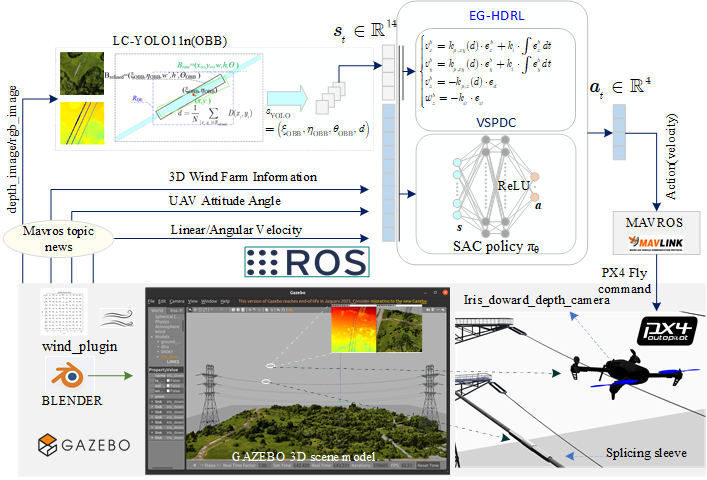

# EG-HDRL-UAV-ASS: Expert-Guided Hybrid Deep Reinforcement Learning for UAV Autonomous Docking

[](LICENSE)

This repository presents the implementation of an **Expert-Guided Hybrid Deep Reinforcement Learning (EG-HDRL)** strategy for autonomous UAV docking tasks. The system integrates **PX4 + ROS Noetic + Gazebo11**, and supports **rotated object detection (YOLO11N-OBB)** and **wind disturbance simulation**. It is suitable for intelligent aerial manipulation tasks involving cylindrical overhead line targets (e.g., splice sleeves).

---

## 📊 Architecture Overview

### ▶ EG-HDRL Control Framework  


> Figure 1: The control pipeline integrates expert trajectory generation, YOLO-based perception, and hybrid policy optimization with SAC.

---

### ▶ Simulation System Diagram  


> Figure 2: Simulation platform architecture integrating PX4, Gazebo, ROS, wind plugin, and perception modules.

---

## 🧰 System Requirements

| Component        | Version / Notes                  |
|------------------|----------------------------------|
| Operating System | Ubuntu 20.04.6 LTS               |
| ROS              | Noetic                          |
| PX4              | Latest stable release (from source) |
| Gazebo           | Version 11                      |
| Python           | 3.8+                            |
| Libraries        | PyTorch, Gym, NumPy, Matplotlib |
| Perception       | YOLO11N (OBB), pre-trained model |

---

## 🚀 Quick Start Guide

### 1️⃣ Setup PX4 Simulation Environment

- Replace the default PX4 launch file:

```bash
cp EG-HDRL-UAV-ASS/PX4-Autopilot/launch/posix_sitl.launch PX4-Autopilot/launch/
```

- Add custom wind-world file:

```bash
cp EG-HDRL-UAV-ASS/PX4-Autopilot/worlds/SS_Drone0409_wind.world PX4-Autopilot/Tools/simulation/gazebo-classic/sitl_gazebo-classic/worlds/
```

- Download `gazebo_world_component.zip`, unzip it, and ensure all `.dae` model paths in the `.world` file are valid:

```xml
<uri>/your/path/to/S_ditu.dae</uri>
```

- Adjust wind field parameters via `<wind_plugin>` in the `.world` file as needed.

---

### 2️⃣ Set Up Reinforcement Learning Environment

- Install OpenAI Gym:

```bash
pip install gym
```

- Copy environment scripts into your local Gym environment path:

```bash
cp gym_env/*.py ~/.local/lib/python3.8/site-packages/gym/envs/classic_control/
```

---

### 3️⃣ Configure Perception Model

- Place the YOLO11N model checkpoint in the appropriate path:

```python
yolo = torch.load("LC_YOLO11n(OBB)/best.pt")
```

Make sure the `drone_env_wind.py` file loads it correctly during initialization.

---

### 4️⃣ Run Training and Evaluation

- Launch ROS and PX4 simulation in three terminals:

```bash
roscore
roslaunch mavros px4.launch fcu_url:="udp://:14540@127.0.0.1:14557"
roslaunch px4 posix_sitl.launch
```

- Train the EG-HDRL strategy:

```bash
python train.py --env UAVDockingEnv --algo EG-HDRL --episodes 500
```

- Evaluate the trained policy:

```bash
python evaluate.py --model EG-HDRL/model/eg_hdrl_best.pth
```

---

## 🧠 Trained Models and Resources

- Trained EG-HDRL model:  
  `EG-HDRL-UAV-ASS/EG-HDRL/model/`

- Pre-trained YOLO11N-OBB checkpoint:  
  `EG-HDRL-UAV-ASS/LC_YOLO11n(OBB)/best.pt`

---

## 📎 Supplementary Materials

Additional materials are hosted at:  
👉 [https://github.com/z0810gc/EG-HDRL-UAV-ASS](https://github.com/z0810gc/EG-HDRL-UAV-ASS)

Includes:
1. A demonstration video of the EG-HDRL strategy  
2. Core training scripts and simulation code  

---

## 📄 License

This project is released under the [MIT License](LICENSE).

---

Feel free to cite or reuse this project for academic and research purposes.  
Issues and contributions are welcome!